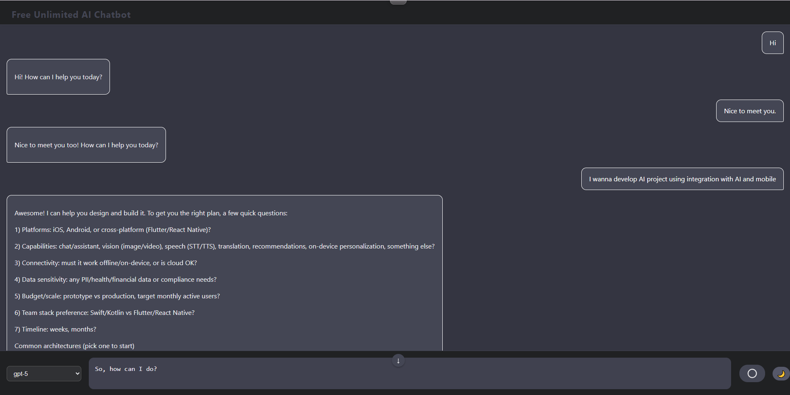

# AuroraSpeak

AuroraSpeak is a lightweight web client that lets you chat with locally configured AI services through a clean, responsive interface. The focus is on clarity, speed, and full transparency over which model is responding.

---

## Highlights

- Seamless single-page UI with instant model switching.
- Supports both conversational and image-style prompts.
- Friendly error messaging with built-in retry guidance.
- Works entirely in the browser — no server setup required.

---

## Interface Preview

---

## Quick Start

1. Clone or download the project files.
2. Open `index.html` in your browser.
3. Configure your preferred models inside `models.json`.
4. Start chatting instantly.

---

## Project Layout

- `index.html` — main application shell.
- `app.js` — chat orchestration, model handling, and rendering logic.
- `style.css` — layout, theming, and responsive design rules.
- `models.json` — curated list of model identifiers shown in the UI.
- `new-feature.html` — experimental playground for upcoming UI ideas.

---

## Configuration Tips

- Add or remove model identifiers by editing `models.json`.
- Toggle default model selection through the `defaultModel` field in `app.js`.
- Adjust theme colors and spacing via CSS variables in `style.css`.

---

## Contributing

- Fork the project or open an issue describing the change you have in mind.
- Keep pull requests focused on a single improvement.
- Include a short summary of manual testing or screenshots where appropriate.

---

## Roadmap

- Add optional voice input for hands-free sessions.
- Expand support for streamed responses.
- Introduce offline-first caching for frequently used prompts.

---

## License

This project is released under the terms of the included `LICENSE`.
